# Тема 1. Работа с репозиториями.
Отчет по Теме #1 выполнил(а):
- Куликов Кирилл Евгеньевич    
- ИНО ЗБ ПОАС 22-1

| Задание | Сам_раб |
| ------ | ------ |
| Задание 1 | + |
| Задание 2 | + |
| Задание 3 | + |
| Задание 4 | + |
| Задание 5 | + |
| Задание 6 | + |
| Задание 7 | + |
| Задание 8 | + |
| Задание 9 | + |
| Задание 10 | + |
| Задание 11 | + |
| Задание 12 | + |
| Задание 13 | + |
| Задание 14 | + |
| Задание 15 | + |

знак "+" - задание выполнено; знак "-" - задание не выполнено;

Работу проверили:
- к.э.н., доцент Панов М.А.

## Самостоятельная работа №1
- Установка
  
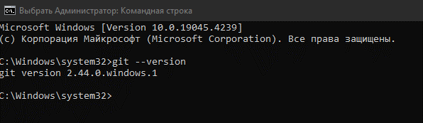)
  
## Самостоятельная работа №2
- Настройка
  
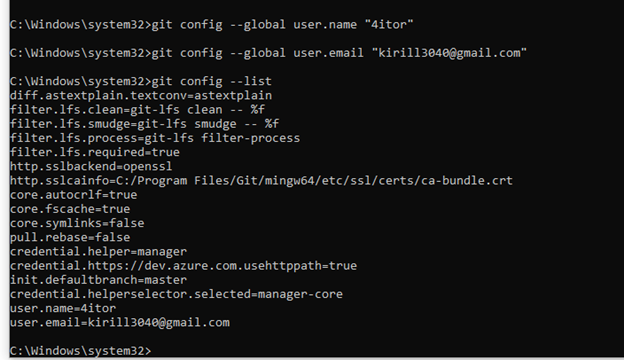)
  
## Самостоятельная работа №3
- Создание нового репозитория
  
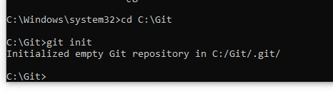)

## Самостоятельная работа №4
- Подготовка файлов
  
)
  
## Самостоятельная работа №5
- Фиксация изменений
  
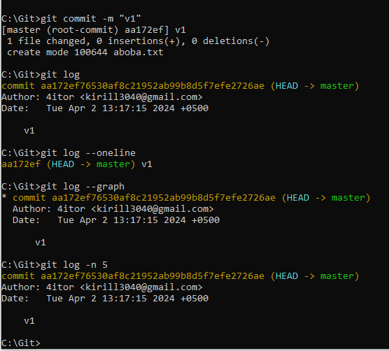)
  
## Самостоятельная работа №6
- Подключение к удаленному репозиторию
  
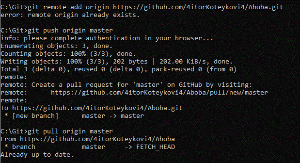)
  
## Самостоятельная работа №7
- Ветвление
  
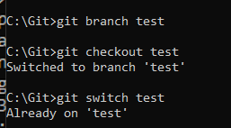)

## Самостоятельная работа №8
- Особенности применения «Фетч»
  
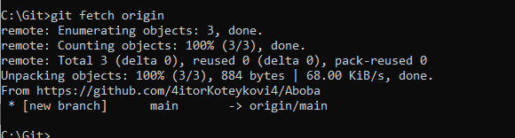)
  
## Самостоятельная работа №9
- Удаление файлов, веток, локальных и удалённых репозиториев
  
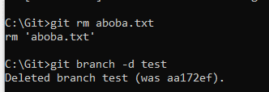)

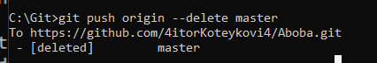)
  
## Самостоятельная работа №10
- Отслеживание изменений в коммитах
  
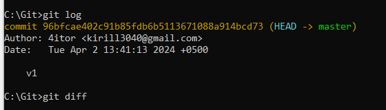)

## Самостоятельная работа №11
- Возвращение файла к предыдущему (определенному) состоянию
  
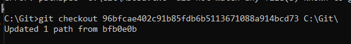)

## Самостоятельная работа №12
- Возвращение к предыдущему коммиту
  
)

## Самостоятельная работа №13
- Исправление коммита
  
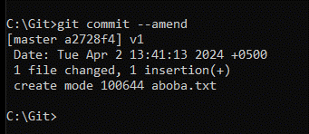)

## Самостоятельная работа №14
- Разрешение конфликтов при слиянии
  
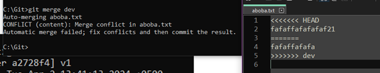)

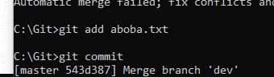)

## Самостоятельная работа №15
- Настройка .gitignore
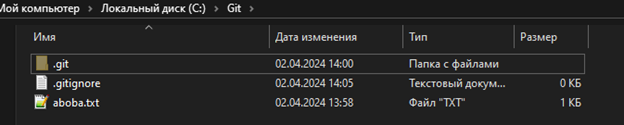)

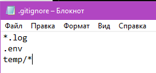)
